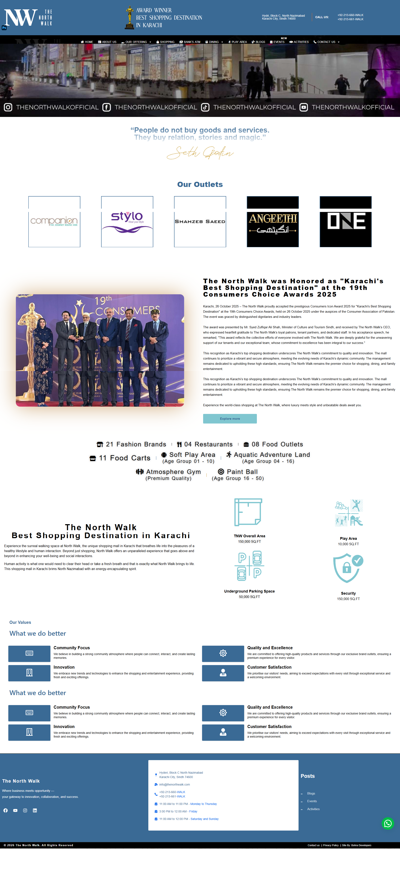
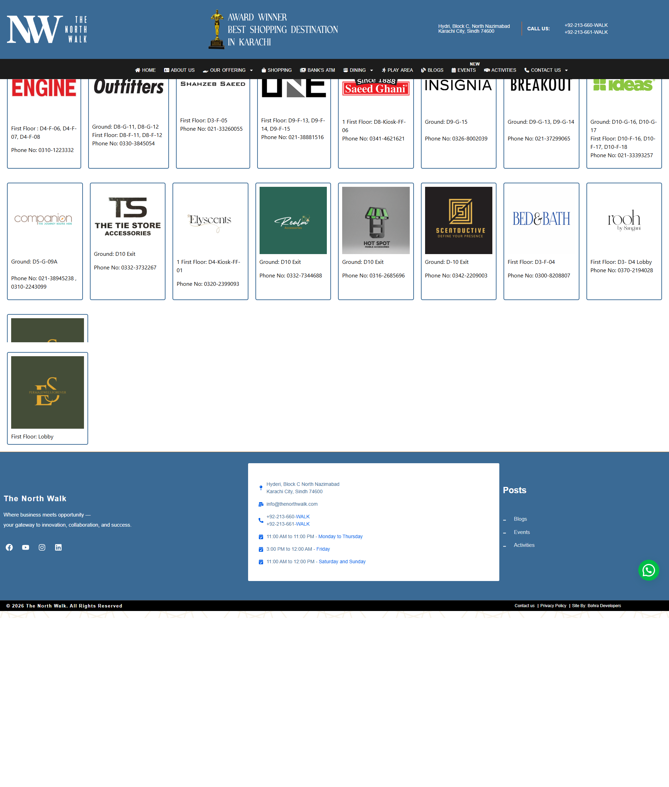
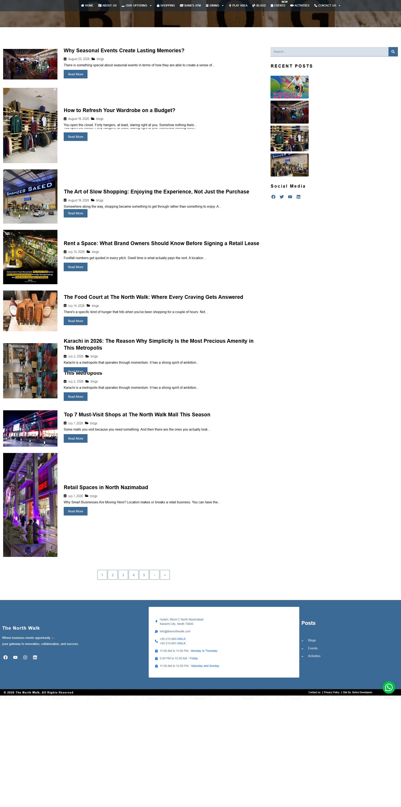
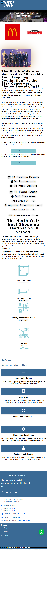

# The North Walk

A complete website redevelopment project for The North Walk, a retail shopping mall in Karachi, focused on delivering a more professional, modern and user-friendly digital experience.

🌐 **Live Website:**  
https://thenorthwalk.com/

## Project Overview

The North Walk previously had a website developed by an outsourced company, but the marketing team identified several issues related to UI/UX, website structure and overall usability.

I was brought in to take over the project and completely redesign and rebuild the website from scratch, creating a cleaner, more modern and customer-focused experience aligned with the mall's branding and marketing requirements.

## My Role

- Complete website redevelopment from scratch
- Website planning and restructuring
- UI/UX redesign
- Front-end development
- Back-end configuration
- Website structure and layout development
- Responsive design implementation
- Mobile and tablet optimization
- CMS configuration and content management
- Custom styling and functionality
- Brand-focused design implementation
- Store and business information presentation
- Navigation and usability improvements
- Performance optimization
- Speed optimization
- Image and asset optimization
- Forms and integrations
- Cross-browser compatibility
- Technical troubleshooting
- Website testing
- Deployment and launch
- Ongoing website maintenance and improvements

## Project Objective

The primary objective was to replace the previous website with a completely redesigned digital experience that better represented The North Walk as a retail shopping destination.

The redevelopment focused on improving navigation, content presentation, visual consistency, responsiveness and overall usability for visitors browsing the website across desktop, tablet and mobile devices.

## Key Improvements

- Complete redesign of the previous website
- Improved UI/UX
- Cleaner and more professional visual presentation
- Better website structure and navigation
- Improved mobile responsiveness
- More consistent branding
- Better content organization
- Enhanced customer experience
- Improved performance and usability
- Easier website management
- Cross-device compatibility

## Key Features

- Fully responsive website
- Modern retail-focused interface
- User-friendly navigation
- Shopping mall information presentation
- Store and brand presentation
- Mobile-friendly experience
- CMS-powered content management
- Contact and inquiry functionality
- Optimized website structure
- Performance-focused development
- Cross-browser compatibility
- Scalable website architecture

## Project Assets

### Homepage

### Stores & Brands

### Blogs

### Mobile Experience

## Project Type

**Retail Shopping Mall / Corporate Website**

## Development Type

**Complete Website Redesign & Redevelopment**

## Status

🟢 **Live & Operational**

## Website

[Visit The North Walk](https://thenorthwalk.com/)

## Developer

**Muhammad Aliakber**

Web Developer specializing in end-to-end web solutions, UI/UX, website redevelopment and performance optimization.

[GitHub](https://github.com/mrajdeveloper)
